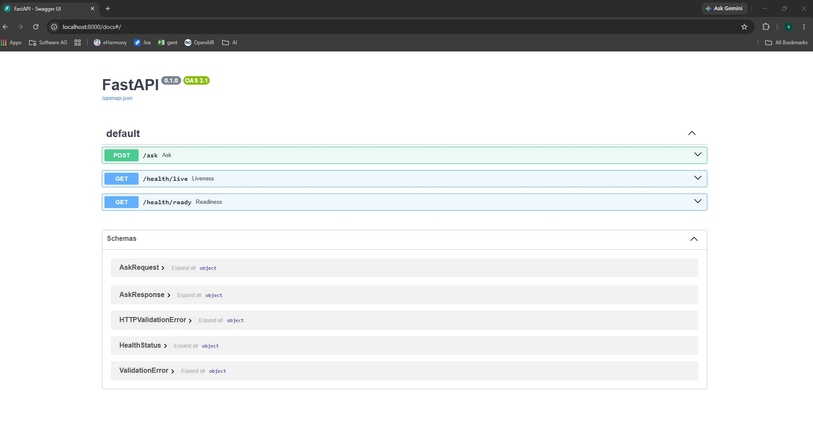

# SpecMind

SpecMind is a Retrieval-Augmented Generation (RAG) service that answers questions about the Java Language Specification (JLS). It combines hybrid retrieval (vector + BM25) with a multi-stage LangGraph pipeline that resolves conversational context, retrieves and evaluates evidence, and generates grounded, natural-language answers over HTTP.

The goal is to let someone ask JLS questions in plain English — including follow-ups that depend on earlier turns — and get an answer that's actually backed by the text of the spec, not a hallucinated paraphrase of it.

## Features

* Hybrid retrieval combining Qdrant vector search with BM25 lexical search
* Multi-stage RAG pipeline orchestrated as a LangGraph `StateGraph`
* Conversation understanding for follow-up questions across turns
* Session-scoped conversational memory, persisted back after every turn
* LLM-based intent resolution and retrieval query construction
* LLM-based reranking of retrieved passages
* Context sufficiency evaluation with a one-shot query-rewrite retry
* Grounded reasoning and structured, LLM-generated final answers
* FastAPI HTTP interface with auto-generated Swagger/Redoc docs
* Single-command Docker Compose setup (app + Qdrant + JLS PDF)

## Configuration

| Variable | Required | Default | Purpose |
|---|---|---|---|
| `OPENAI_API_KEY` | Yes | — | Used by the LLM and embedding clients |
| `OPENAI_MODEL` | No | `gpt-4.1-mini` | Chat model |
| `OPENAI_EMBEDDING_MODEL` | No | `text-embedding-3-small` | Embedding model |
| `OPENAI_EMBEDDING_DIMENSIONS` | No | `1536` | Must match the embedding model's vector size |
| `QDRANT_URL` | No | `http://localhost:6333` | Qdrant endpoint |
| `QDRANT_COLLECTION_NAME` | No | `jls_chunks` | Qdrant collection for JLS chunks |
| `JLS_PDF_PATH` | No | `data/jls25.pdf` | PDF used to build the BM25 index at startup |

None of these are required to run the unit tests, which use deterministic fakes and an in-memory Qdrant client.

## Testing

### Automated Tests

```bash
python -m pytest
```

Unit and integration tests against deterministic fakes — no API key, Qdrant, or Docker needed.

### End-to-End QA (AI-assisted)

A manual QA test plan (`data/RAG-System-Test-Plan.md`) covers 38 conversational test cases plus a regression suite, stress-testing retrieval accuracy, hallucination resistance, and prompt-injection attempts against the real running system.

**Update:** executed against the live stack on 2026-07-26 — 30 of 38 tests passed cleanly.

Held up well:
* Prompt-injection resistance (three separate attempts)
* Reasoning across multiple JLS passages (e.g. try-with-resources exception suppression, `volatile`/happens-before)
* Honest section citations, no fabricated numbers

Failed:
* Basic definitional questions retrieved inconsistently — "What is autoboxing?" and "difference between interface and abstract class" failed on their plain phrasing but succeeded when asked in a more elaborate way, pointing to a retrieval/query-construction bug rather than missing content
* The predicted memory gap was confirmed in production — under an ambiguous follow-up, the system didn't fail safely, it confidently answered a different, unrelated question by latching onto a repeated keyword

Full results in `data/RAG-System-Test-Results.md`.

**Update (2026-08-03):** the two root causes behind most of the findings above were fixed — `MemoryStore.add_facts` is now wired via a `persist_memory` graph node that runs after generation, and `VectorSearch.ingest` is now actually called at startup (batched at 100 chunks/request, after an unbatched single upsert of the full 1,375-chunk corpus caused Qdrant connection resets). Re-running the full plan against the live stack afterward resolved all 4 original HIGH-severity findings and 3 of 4 MEDIUM findings; two LOW-severity polish nits and one compound-question retrieval inconsistency remain open. Full comparison in `data/RAG-System-Test-Results-Rerun.md`.

### Reproducing the QA Run

Have Claude execute it:

```
Start the app per Getting Started, then run the QA test plan in data/RAG-System-Test-Plan.md
against it via POST /ask, and write up the results in a document.
```

## Getting Started

**Run the app**

```bash
cp .env.example .env        # macOS / Linux
# copy .env.example .env    # Windows
```

Set a real `OPENAI_API_KEY` in `.env`, then:

```bash
docker compose up --build -d
```

That's the whole setup — the app and Qdrant come up together, JLS PDF included. See [Using the API](#using-the-api) to start asking questions.

**Developing Locally**

Only needed if you're changing code, not just running the app.

```bash
python -m venv .venv
.venv/Scripts/activate      # Windows
# source .venv/bin/activate # macOS / Linux

pip install -e ".[dev]"
cp .env.example .env        # macOS / Linux
# copy .env.example .env    # Windows
```

Then open `.env` and set a real `OPENAI_API_KEY`.

## Using the API

`session_id` is optional — omit it to start a new session; the server generates one and returns it so you can keep asking follow-up questions in the same conversation.

Other endpoints:

* `GET /health/live` — liveness
* `GET /health/ready` — readiness (503 until the graph has finished building at startup)
* Qdrant is also reachable directly at `http://localhost:6333`

Once the app is up, open **`http://localhost:8000/docs`** — FastAPI's Swagger UI. Expand `POST /ask`, type in a question, and run it directly from the browser. No `curl` required.



Prefer the command line?

```bash
curl -X POST http://localhost:8000/ask \
  -H "Content-Type: application/json" \
  -d '{"question": "What is the difference between a class and an interface?"}'
```

## How It Works

```text
Question
   │
   ▼
Conversation Understanding   — detects whether this is a follow-up and folds prior turns in
   │
   ▼
Memory Retrieval              — pulls relevant session history from MemoryStore
   │
   ▼
Intent Resolution             — resolves what's actually being asked and builds a retrieval query
   │
   ▼
Hybrid Search                 — Qdrant vector search + BM25 over the JLS, merged and deduplicated
   │
   ▼
Reranking                     — LLM reranks candidates by relevance
   │
   ▼
Context Evaluation ──insufficient──► Rewrite Query ──► back to Hybrid Search (one retry only)
   │
   │ sufficient
   ▼
Reasoning                      — grounded reasoning over the retrieved passages
   │
   ▼
Answer Generation              — final natural-language answer
   │
   ▼
Memory Persistence              — saves a fact from this turn into MemoryStore for future turns
```

If the context evaluation step judges the retrieved passages insufficient, the query is rewritten once and retrieval runs a second time. If it's still insufficient after that, the pipeline reasons over whatever was found rather than retrying indefinitely.

## Project Structure

Everything is built around a single LangGraph graph; `container.py` just wires real services into it and `main.py` exposes it over HTTP.

```text
app/
  api/            # FastAPI routes and health endpoints
  graph/          # LangGraph StateGraph definition and state
  nodes/          # Graph node adapters (one per pipeline stage)
  conversation/   # Conversation understanding (follow-up detection)
  intent/         # Intent resolution
  retrieval/      # Vector search, BM25 search, hybrid merge, query rewriting
  reranking/      # LLM-based reranking
  evaluation/     # Context sufficiency evaluation
  reasoning/       # Grounded reasoning over retrieved passages
  generation/     # Final answer generation
  memory/         # Session-scoped MemoryStore
  llm/            # LLM and embedding client wrappers
  chunking/       # PDF loading and chunking for the BM25 index
  models/         # Pydantic request/response and domain models
  config/         # Environment-based settings
  container.py    # Composition root
  main.py         # FastAPI app entrypoint
data/
  jls25.pdf                     # Java Language Specification, used to build the BM25 index
  RAG-System-Test-Plan.md       # Manual QA test plan (see Testing)
  RAG-System-Test-Results.md    # Results from executing the plan above
docs/
  images/         # Assets referenced from this README
tests/            # Mirrors the app/ layout, one test package per module
```

## Future Improvements

**Memory**
* Move memory out of in-process storage so it survives restarts and can be shared across multiple app replicas.
* Have the reasoning stage flag low confidence on short, cross-topic-ambiguous follow-ups instead of confidently answering the wrong question.

**Retrieval**
* Improve retrieval consistency for semantically equivalent questions phrased differently, including compound questions where one half of the question is dropped.
* Make the one-shot query-rewrite retry more effective at recovering from a bad initial hybrid-search pass.

**Ingestion**
* Replace the synchronous, full-PDF BM25 rebuild and vector-embedding ingestion on every startup with a separate ingestion step that supports caching and progress reporting.

**Observability**
* Make `/health/ready` check live Qdrant/LLM connectivity on each poll, rather than only confirming that startup wiring succeeded once.
* Add structured logging across the pipeline, correlated by request/session ID, to make failures and slow stages traceable in production.

**Testing**
* Add an automated end-to-end test against the real Docker stack, complementing the current fake-backed graph and container tests.
* Automate the regression suite so it runs after any prompt, model, or index change.

**Developer Experience**
* Add a dedicated ingestion command/script instead of rebuilding the BM25 index as a startup side effect.
